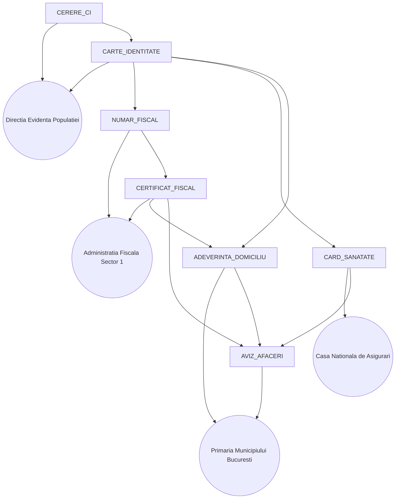

# Bureaucracy Concurrency Simulation

This project models a bustling bureaucratic system where customers chase paperwork across multiple public offices. It demonstrates coordination across queues, cross-office dependencies, and coffee break pauses using the Java Concurrency API.

## Features
- **Multi-counter offices** – each office runs several worker threads that process clients one at a time while honoring queue order.
- **Document dependencies** – obtaining a document can trigger additional document requests, even across offices, without deadlocks.
- **Coffee breaks** – offices periodically suspend service; ongoing transactions finish gracefully while new clients wait for the office to reopen.
- **Classic concurrency primitives** – offices coordinate using `synchronized`/`wait`, semaphores, and latches for an easy-to-explain design.
- **Narrated timeline** – console logs now highlight a citizen’s journey step by step (ARRIVE / REQUEST / QUEUE / TRANSPORTING / CANCELLED / FINISHED) while the full trace is stored in `simulation.log` each run.

## Project Layout
```
src/main/java/com/bureaucracy/
├── Main.java                       # Entry point with sample scenario
├── config/SimulationConfig.java    # Immutable setup for offices & documents
└── simulation/
    ├── BureaucracySimulation.java  # Coordinates offices, customers, breaks
    ├── ConsoleSimulationReporter.java
    ├── CustomerProfile.java
    ├── CustomerSimulation.java
    ├── DocumentManager.java
    ├── DocumentProcessingResult.java
    ├── IssuanceTask.java
    ├── Office.java                 # Queue + break management logic
    ├── OfficeEventListener.java
    ├── OfficeState.java
    └── SimulationReporter.java
```

## Requirements
- Java 17 or newer (for `Duration` enhancements and convenience APIs).

## Building & Running
Compile everything into an `out` directory, then run the main class:
```bash
javac -d out $(find src/main/java -name "*.java")
java -cp out com.bureaucracy.Main
```

The bundled scenario:
- Initializes Romanian-style offices (population records, fiscal agency, city hall, health insurance) with distinct service and break profiles.
- Launches five clients chasing documents such as `AVIZ_AFACERI` or `ADEVERINTA_DOMICILIU`.
- Emits clear terminal lines such as:
```
ARRIVE office Primaria Municipiului Bucuresti person Mihai asking for AVIZ_AFACERI
REQUEST office Primaria Municipiului Bucuresti person Mihai -> AVIZ_AFACERI in progress
QUEUE office Primaria Municipiului Bucuresti person Mihai waiting for AVIZ_AFACERI | line: person Mihai REQUESTING AVIZ_AFACERI, person Vlad REQUESTING AVIZ_AFACERI
COUNTER office Directia Evidenta Populatiei counter 1 now processing person Sorina for CARTE_IDENTITATE
TRANSPORTING from counter: Primaria Municipiului Bucuresti to counter: Administratia Fiscala Sector 1 document: CERTIFICAT_FISCAL
CANCELLED at office Primaria Municipiului Bucuresti person Vlad request AVIZ_AFACERI -> needs ADEVERINTA_DOMICILIU, CERTIFICAT_FISCAL, CARD_SANATATE
FINISHED person Sorina got CARTE_IDENTITATE from Directia Evidenta Populatiei counter 1 LEAVING...
```

## Customizing the Simulation
- **Documents & Offices**: edit `SimulationConfig.sample()` to add or modify offices, counters, service times, break durations, and document dependency chains.
- **Customers**: adjust the list in `Main` (arrival delays and requested documents).
- **Break cadence**: tweak `scheduleNextBreak` inside `BureaucracySimulation` for different pause frequency.

## Notes
- Office workers inline any dependency work for their own office, avoiding re-queuing deadlocks.
- Scheduled coffee breaks wait for active services to finish before pausing threads.
- The slow timings (seconds) are intentional for readability; revert to faster `Duration` values when benchmarking.
- Every run writes a full textual trace to `simulation.log`; only QUEUE / ARRIVED / TRANSPORTING events appear in the terminal for clarity.
### Document dependency graph

